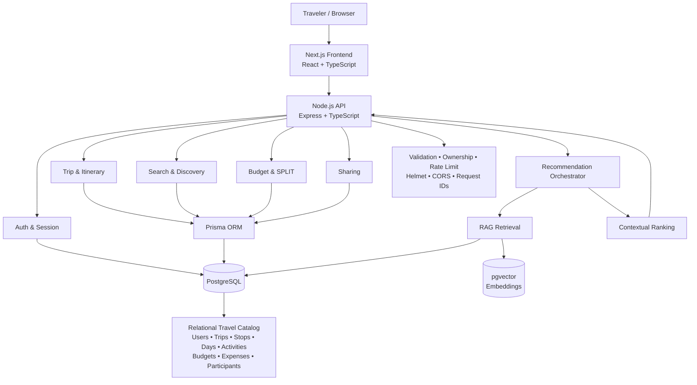
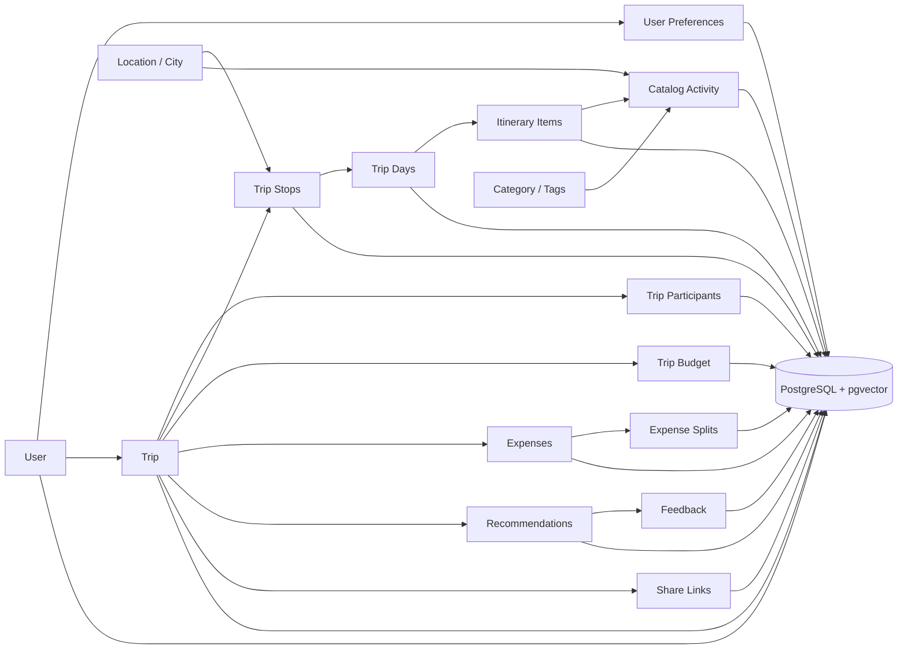
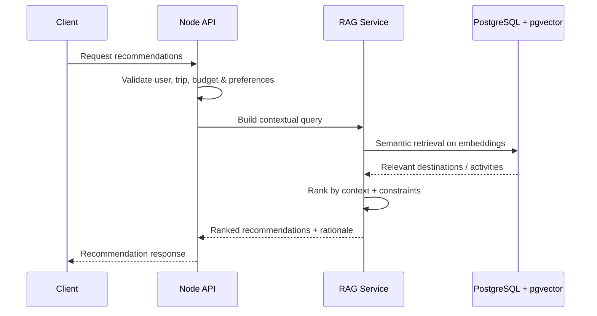

# GlobeTrotter

> **Empowering Personalized Travel Planning** — a database-first, AI-assisted platform for discovering destinations, building multi-city itineraries, controlling budgets, sharing trips, and automatically splitting trip costs across travelers.

<p align="center">
  
</p>

<p align="center">
  <a href="#-why-globetrotter">Why GlobeTrotter</a> ·
  <a href="#-core-features">Features</a> ·
  <a href="#-architecture">Architecture</a> ·
  <a href="#-tech-stack">Tech Stack</a> ·
  <a href="#-database-first-design">Database</a> ·
  <a href="#-quick-start">Quick Start</a>
</p>

<details>
<summary><strong>📑 Table of Contents</strong></summary>

- [Why GlobeTrotter](#-why-globetrotter)
- [Core Features](#-core-features)
  - [ SPLIT — Automatic Trip Cost Sharing](#-split--automatic-trip-cost-sharing)
  - [ AI Recommendations with RAG + pgvector](#-ai-recommendations-with-rag--pgvector)
  - [Advanced Search & Filtering](#-advanced-search--filtering)
  - [ Multi-City Itinerary Builder](#️-multi-city-itinerary-builder)
  - [ Budget & Expense Intelligence](#-budget--expense-intelligence)
  - [ Timeline / Calendar](#-timeline--calendar)
  - [ Public Sharing](#-public-sharing)
  - [ Profiles & Preferences](#-profiles--preferences)
- [Architecture](#-architecture)
- [Tech Stack](#-tech-stack)
- [Database-First Design](#-database-first-design)
- [Security & Engineering](#-security--engineering)
- [Project Structure](#-project-structure)
- [Quick Start](#-quick-start)
- [Scope](#-scope)
- [Repository](#-repository)

</details>

---

## Why GlobeTrotter

GlobeTrotter directly addresses the hackathon problem: **personalized multi-city travel planning backed by a well-designed relational database**. Users can create trips, manage stops and activities, assign dates and budgets, discover destinations, visualize the journey, and share complete plans. fileciteturn0file1L27-L36

### What makes our solution stand out

| Differentiator | Impact |
|---|---|
| **SPLIT** | Automatically converts a shared trip into **per-person cost allocation** and keeps expense ownership/splits tied to the trip data model. |
| **RAG + pgvector AI** | Semantic retrieval over destinations/activities + user preferences + trip context produces **grounded, explainable recommendations** instead of static/random suggestions. |
| **Advanced Search** | DB-backed search with composable filters for destination/activity discovery — no hardcoded catalog logic in the UI. |
| **Database-first architecture** | Users, trips, stops, days, activities, budgets, expenses, recommendations, participants and sharing are persisted as relational data with clear ownership and relationships. |
| **End-to-end planning** | Discover → plan → schedule → budget → split → recommend → visualize → share. |

---

## Core Features

### SPLIT — Automatic Trip Cost Sharing

> **Our signature feature:** when a trip has multiple travelers, eligible shared costs are **automatically split across participants**.

- Participant-aware trip model
- Equal / configurable split-ready expense design
- Per-person allocation and contribution tracking
- Shared vs. individual expense ownership
- Budget visibility at **trip + traveler** level
- Designed for extension to settlement / balances without restructuring the core trip schema

This extends the problem statement's budgeting requirement from simply estimating trip cost to understanding **who owes what**.

### AI Recommendations with RAG + pgvector

**Personalized retrieval pipeline:**

```text
User preferences + trip context + budget
                  │
                  ▼
          Embedding / Query
                  │
                  ▼
        PostgreSQL + pgvector
        Semantic candidate retrieval
                  │
                  ▼
 Context-aware ranking / filtering
                  │
                  ▼
   Recommended place / activity
      + reason + budget fit
```

Recommendations can use destination, itinerary context, interests, budget, ratings and diversity signals while keeping the canonical travel data in PostgreSQL.

### Advanced Search & Filtering

Search is **database-backed and composable**, not hardcoded into frontend components.

- Full-text / semantic-ready destination & activity discovery
- Country / region / city
- Category / interest
- Price range / estimated cost
- Duration
- Rating / popularity
- Search query
- Budget-aware filtering
- Extensible vector similarity for semantic discovery

### Multi-City Itinerary Builder

- Create custom trips with start/end dates
- Add and reorder city stops
- Assign arrival/departure windows
- Generate trip days from travel dates
- Add activities to specific days
- Validate date boundaries and schedule overlaps
- Edit duration, time, cost and ordering

### Budget & Expense Intelligence

- Total, estimated and actual spend
- Category/day-wise breakdowns
- Average daily cost
- Budget progress & warnings
- Expense ownership and participant splits
- Trip-wide and per-person financial visibility

### Timeline / Calendar

- Day-wise itinerary
- City-grouped activities
- Start time + duration + cost
- Calendar/list views
- Reordering and quick editing

### Public Sharing

- Generate shareable trip links
- Read-only itinerary view
- Copy shared trips into an account
- Public DTOs keep private/authentication data out of shared responses

### Profiles & Preferences

- Profile & locale
- Preferred currency
- Travel pace / comfort
- Favorite activity categories
- Saved destinations
- Preferences used by recommendation ranking

The core product scope maps directly to the supplied problem statement's authentication, dashboard, trip creation, itinerary builder, search, budget, timeline, public sharing, profile, and optional analytics flows. fileciteturn0file1L41-L52 fileciteturn0file1L55-L75 fileciteturn0file1L78-L98 fileciteturn0file1L101-L121

---

## Architecture

### High-Level System



### Database-Centric Domain Flow



### AI/RAG Request Path



---

## Tech Stack

| Layer | Stack | Responsibility |
|---|---|---|
| **Frontend** | **Next.js, React, TypeScript** | Responsive application + routing + UI |
| UI / Data | Tailwind CSS, shadcn/ui, TanStack Query, React Hook Form, Zod | Consistent UI, server state, forms & validation |
| **Backend** | **Node.js, Express, TypeScript** | REST API, business logic, security & orchestration |
| ORM | **Prisma** | Type-safe relational access + migrations |
| **Database** | **PostgreSQL** | System of record for all core travel data |
| Vector Search | **pgvector** | Embeddings + semantic retrieval for AI recommendations |
| AI / RAG | **RAG pipeline + embedding/ranking layer** | Context-aware recommendations grounded in stored travel data |
| Recommendation Service | **Python** | Recommendation / AI processing layer |
| Charts / UX | Recharts, Framer Motion, Lucide | Analytics, motion & interaction |
| DevOps | Docker, Docker Compose | Reproducible local infrastructure |

---

## Database-First Design

The database is the **source of truth**, not a secondary storage layer.

Core relational domains:

```text
Users
 ├── Sessions
 ├── Preferences
 └── Saved Destinations

Trips
 ├── Participants ──► User
 ├── Stops ──► Locations
 ├── Days
 │    └── Itinerary Items ──► Activities
 ├── Budget
 ├── Expenses
 │    └── Expense Splits ──► Participants
 ├── Recommendations
 │    └── Feedback
 └── Share Links

Catalog
 ├── Locations
 ├── Activities
 ├── Categories / Tags
 └── Media

AI Retrieval
 └── Embeddings ──► pgvector
```

**Design principles**

- Relational modeling for complex, user-specific travel data.
- Explicit foreign-key relationships and ownership boundaries.
- Reusable catalog entities instead of duplicating destination/activity data.
- Trip participants and expense splits make **SPLIT** a first-class data capability.
- Canonical travel content is retrieved from the backend/database; production UI does not depend on hardcoded travel records.
- PostgreSQL extensions such as **pgvector** can support semantic retrieval without introducing a second primary database.

The problem statement explicitly emphasizes proper relational storage/retrieval of user-specific itineraries, stops, activities and estimated expenses. fileciteturn0file1L33-L36

---

## Security & Engineering

- HTTP-only cookie authentication
- Access + refresh token flow
- Password hashing
- Zod request validation
- Resource ownership checks
- CORS allowlist
- Helmet security headers
- Rate limiting
- Structured logging + request IDs
- Environment-based secrets
- Restricted public trip DTOs

---

## Project Structure

```text
GlobeTrotter/
├── frontend/                 # Next.js application
├── backend/                  # Node.js + Express + Prisma API
│   ├── prisma/               # Schema + migrations
│   └── src/modules/          # Auth, trips, itinerary, budget, SPLIT, search, AI...
├── recommendation-engine/   # Python recommendation / RAG layer
├── docs/
│   └── image/
│       └── banner.jpg
└── README.md
```

---

## Quick Start

### Prerequisites

`Node.js` · `npm` · `Docker Desktop` · `Python 3.x` · `PostgreSQL`

### 1. Database

```bash
cd backend
docker compose up -d
npm install
npx prisma generate
npx prisma migrate dev
```

### 2. Backend

```bash
npm run dev
```

Default API:

```text
http://localhost:5000/api/v1
```

### 3. Frontend

```bash
cd ../frontend
npm install
npm run dev
```

Default web app:

```text
http://localhost:3000
```

### 4. Recommendation / RAG Service

```bash
cd ../recommendation-engine
python -m venv .venv
# activate the environment
pip install -r requirements.txt
python main.py
```

---

## End-to-End Flow

```text
Sign up
  ↓
Create trip
  ↓
Add cities & dates
  ↓
Discover with advanced search/filtering
  ↓
Build day-wise itinerary
  ↓
Generate AI recommendations (RAG + pgvector)
  ↓
Track budget & expenses
  ↓
Enable automatic SPLIT across travelers
  ↓
Review calendar / timeline
  ↓
Share or copy trip
```

---

## Scope

GlobeTrotter focuses on the core hackathon journey: **travel planning, destination/activity discovery, budgeting, itinerary visualization, personalization and sharing**. The supplied specification also identifies admin/analytics as an optional extension. fileciteturn0file1L128-L135

---

## Repository

**GitHub:** `https://github.com/Krish91113/GlobeTrotter`

---

<p align="center">
  <strong>GlobeTrotter</strong> — Plan smarter. Split fairly. Travel personally.
</p>
